# SPA-Demo-CRUD
demo app (crud): react // c# .net core && web-api // authorization + registration + [reCaptcha v2](https://github.com/badhitman/reCaptcha)

решение не имеет практического применения. обычная демка для частных нужд.

Окно неавторизованного пользователя:
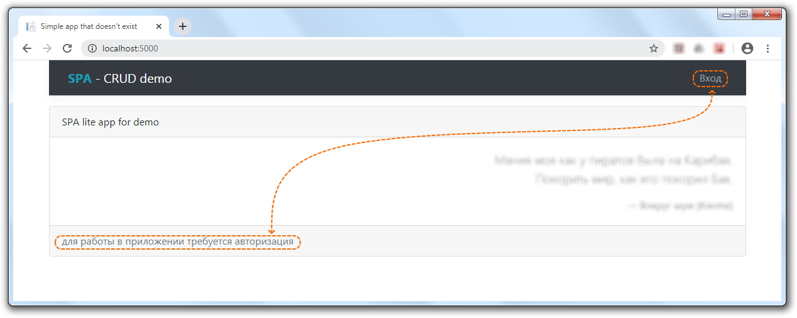

Для **"Debug"** сборок при включении в конфигурационном файле "загрузки" демо-данных (требуются выполнение обоих условий) в интерфейсе «аутентификации» выводится вспомогательная функциональная область для упрощённого входа в различные учётные записи. У каждой демо-учётки права соответствуют её имени (если роль не была переназначена вручную).
Для быстрого заполнения формы авторизации учётными данными из данной «подсказки», достаточно совершить двойной клик по интересующей учётной записи.
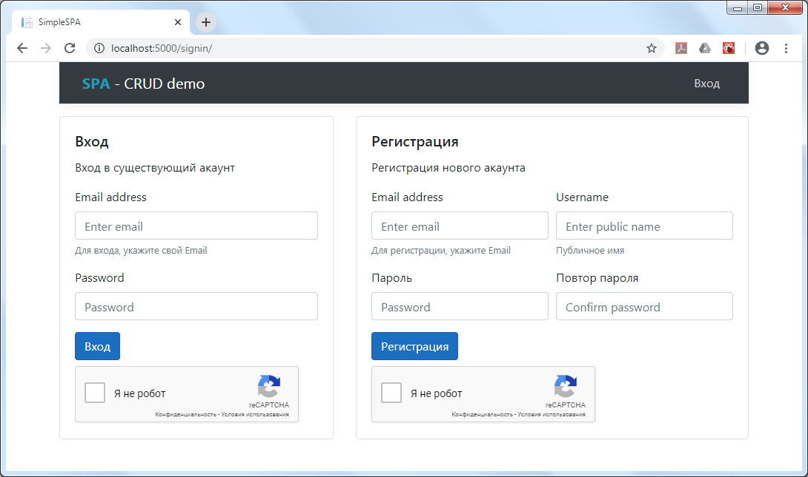

Системное/серверное сообщение контроля валидации моделей для отправляемых форм входа/регистрации.
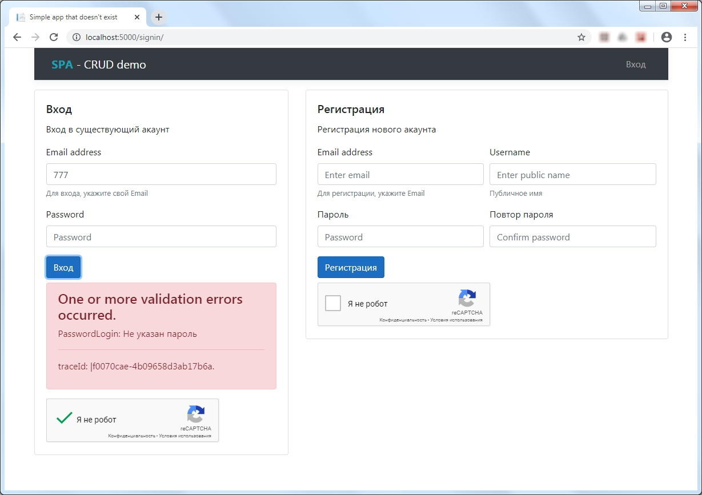

Кроме валидации модели сервер сообщает о статусе отправляемого запроса. В случае ошибки будет выведено соответствующее уведомление.
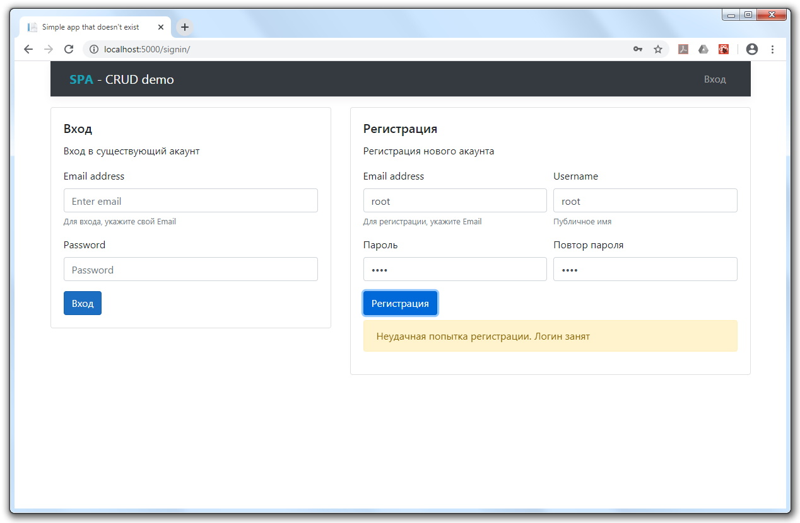

Поддержка [reCaptcha v2](https://github.com/badhitman/reCaptcha). Для включения/отключения данной системы контроля в настройках нужно добавить/удалить (равно, как и закомментировать/раскомментировать) ваши ключи от reCaptcha.
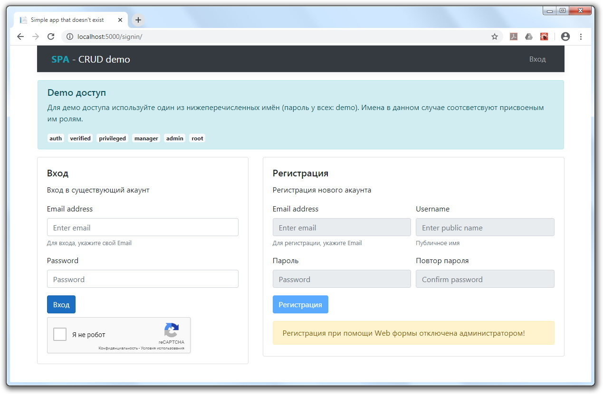

В зависимости от назначенной роли/политики пользователю выводиться соответствующее меню. Состав меню для каждой роли/политики формируется на стороне сервера. Политики выстроены в вертикальную иерархию и наследуются от младшего к старшему.
Другими словами: на контроллеры и их методы накладываются не конкретные роли, а минимальный требуемый уровень.
В таком случае доступ к web-api имеют все, кто чей уровень доступ равен требуемому уровню или старше.

Меню простого авторизованного пользователя
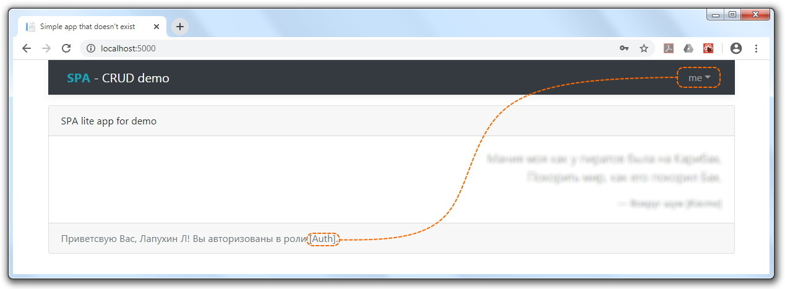

Меню администратора
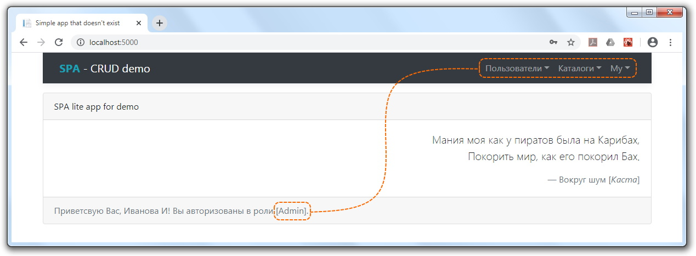

Меню для **root**.
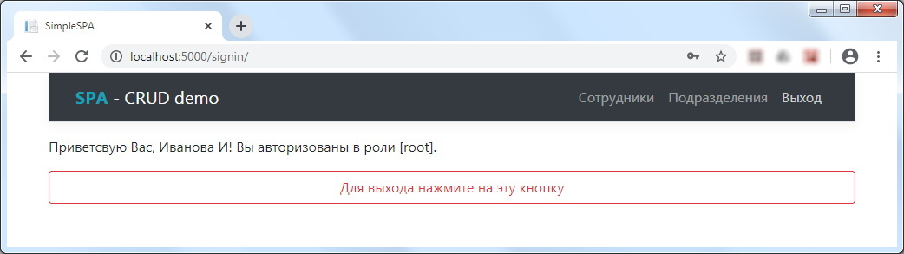

Контроль доступа web-api. Если клиент попытается получить доступ к web-api, прав на которое ему не хватает, то он будет перенаправлен на страницу ошибки.
Контроль доступа организован на сервере средствами **asp.net core**, а клиент отображает «заглушку» для подобной ошибки.
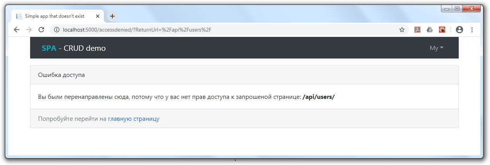

Список отделов/департаментов
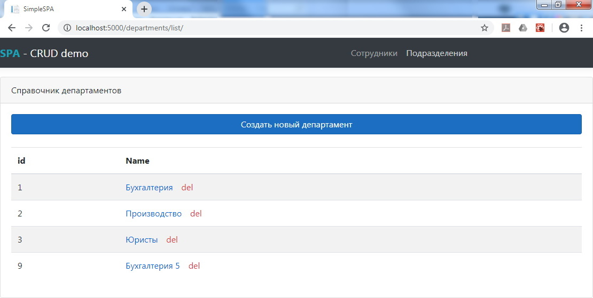

Карточка департамента с пользователями. Если у департамента есть назначенные пользователи, то они будут отображены снизу
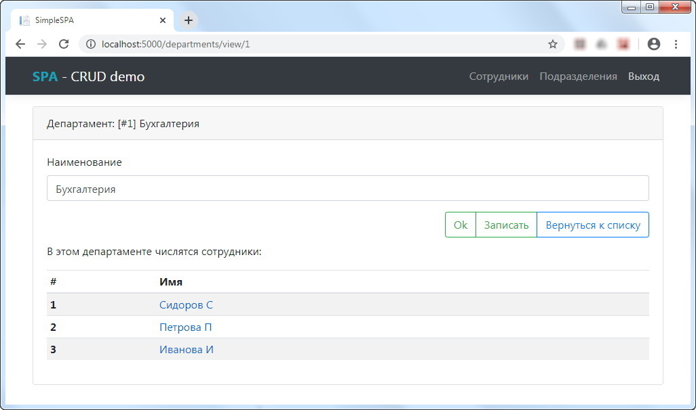

Пример департамента, за которым не закреплён ни один пользователь
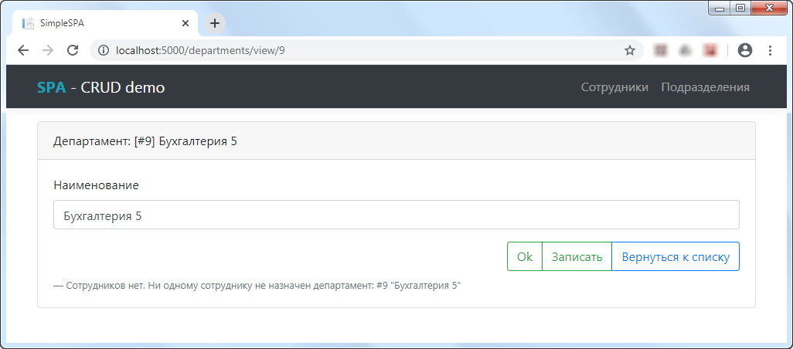

Удаление департамента каскадно удалит и всех прикреплённых пользователей.
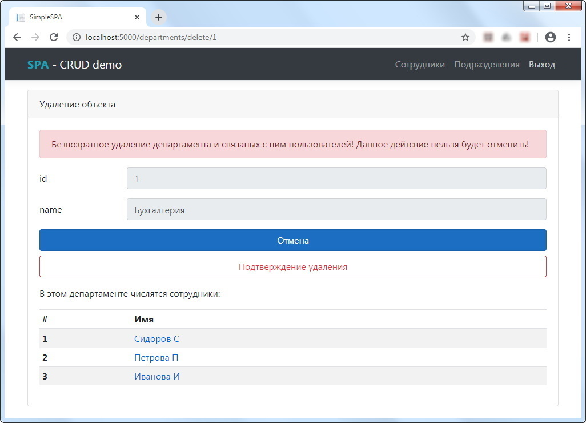

Список пользователей. Роли/права выделены слева от имени
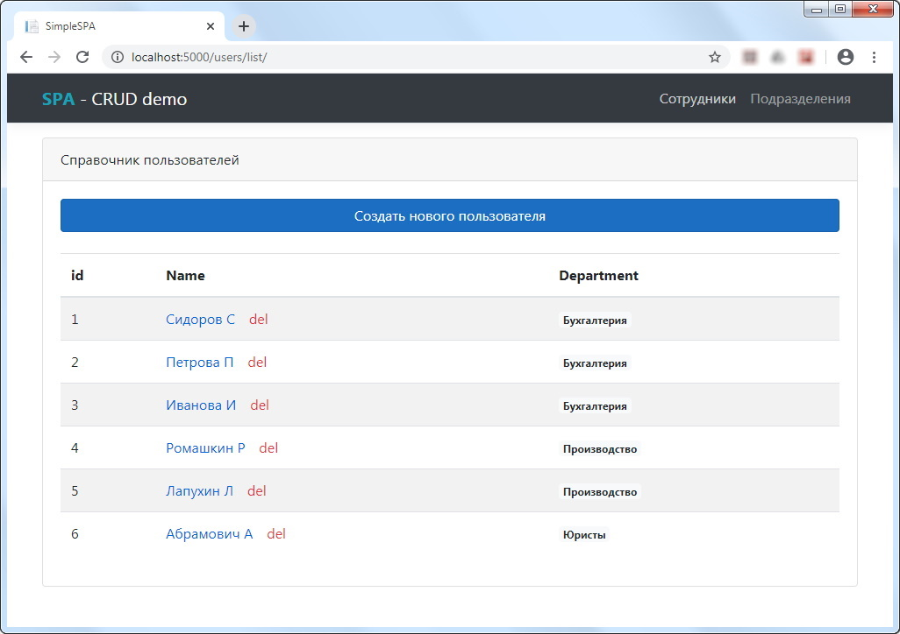

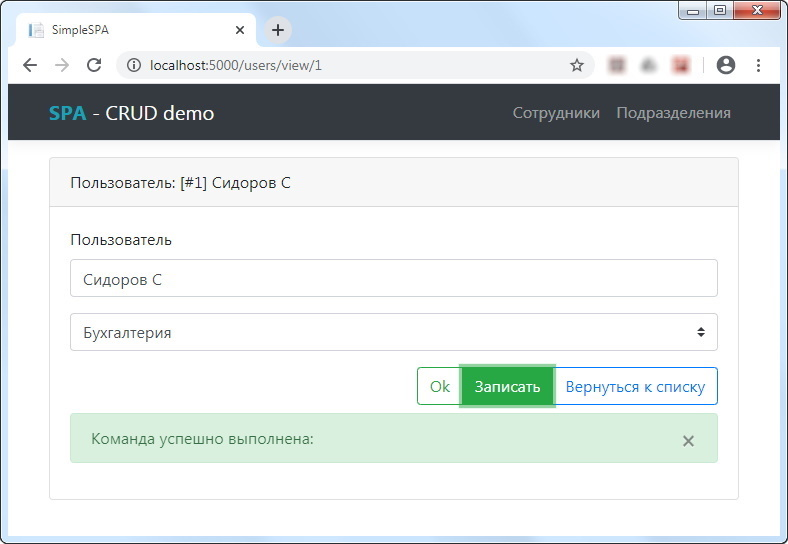

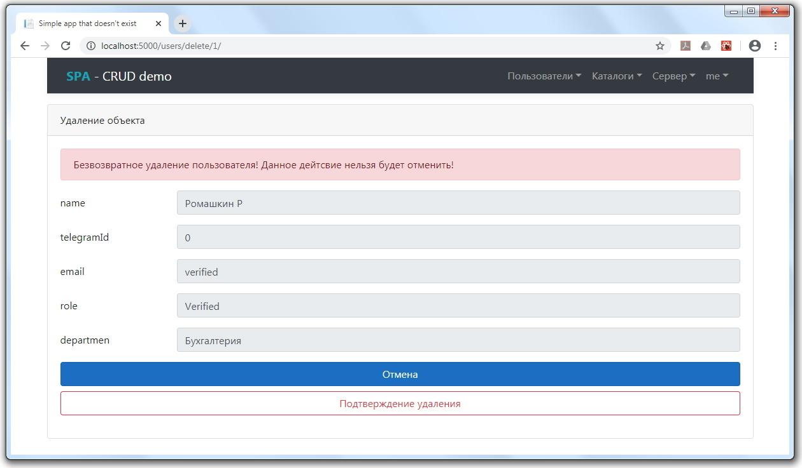

Пример содержания конфигурационного файла

